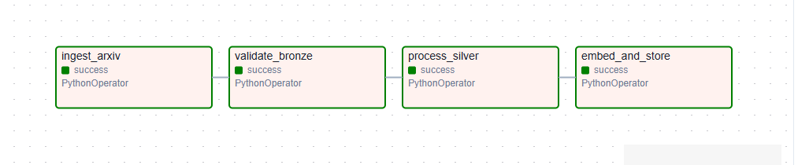
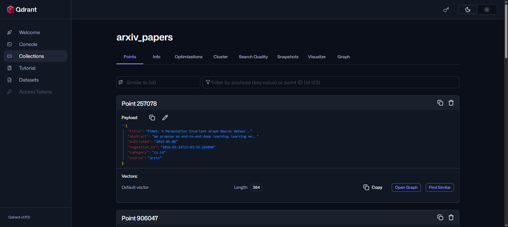

# DocFlow: AI-Ready Document Intelligence Pipeline

A production-style data pipeline that ingests academic research papers, validates data quality, processes and cleans them, generates semantic embeddings, and stores them in a vector database — making the data AI-ready for any downstream RAG application.

---

## Architecture


```
arXiv API
    │
    ▼
┌─────────────────────────────────────────────────────┐
│                   AIRFLOW DAG                        │
│                                                     │
│  ┌──────────┐    ┌──────────┐    ┌──────────┐    ┌──────────┐  │
│  │  Ingest  │───▶│ Validate │───▶│ Process  │───▶│  Embed   │  │
│  │  arXiv   │    │  Bronze  │    │  Silver  │    │ & Store  │  │
│  └──────────┘    └──────────┘    └──────────┘    └──────────┘  │
└─────────────────────────────────────────────────────┘
    │                   │               │               │
    ▼                   ▼               ▼               ▼
 Bronze              Great           Silver           Qdrant
 JSON files       Expectations      Parquet          Vector DB
 (raw data)       Validation       (cleaned)        (embeddings)
```

### Medallion Architecture

| Layer | Format | Location | Description |
|---|---|---|---|
| Bronze | JSON | `./bronze/` | Raw arXiv API response, no transformations |
| Silver | Parquet | `./silver/` | Cleaned, deduplicated, enriched with computed fields |
| Gold | Vectors | Qdrant | 384-dimension embeddings ready for semantic search |

---

## Stack

| Tool | Role | Why |
|---|---|---|
| **Apache Airflow** | Orchestration | Industry standard, DAG-based scheduling |
| **Great Expectations** | Data Quality | Validates bronze data before processing |
| **Polars** | Data Processing | Faster than pandas, modern DataFrame API |
| **FastEmbed** | Embeddings | Lightweight ONNX-based embeddings, no GPU needed |
| **Qdrant** | Vector Database | Best Docker support, clean Python client, production-grade |
| **Docker Compose** | Infrastructure | Reproducible local stack |
| **PostgreSQL** | Airflow Metadata | Airflow scheduler backend |

---

## Project Structure

```
docflow/
├── dags/
│   └── docflow_dag.py          # Airflow DAG definition
├── ingestion/
│   └── ingest_arxiv.py         # Bronze layer — arXiv API ingestion
├── processing/
│   ├── process_silver.py       # Silver layer — Polars cleaning & enrichment
│   └── embed_and_store.py      # Gold layer — FastEmbed + Qdrant upsert
├── data_quality/
│   └── validate_bronze.py      # Great Expectations validation suite
├── config/
│   └── pipeline_config.py      # Centralized config
├── bronze/                     # Raw JSON files (gitignored)
├── silver/                     # Processed Parquet files (gitignored)
├── logs/                       # Airflow logs (gitignored)
├── docker-compose.yml
├── Dockerfile
├── requirements.txt
└── .env                        # Local environment variables (gitignored)
```

---

## Data Flow



### 1. Ingestion (Bronze)
Fetches research papers from the arXiv API across two categories (`cs.AI`, `cs.LG`). Implements retry logic with exponential backoff for rate limiting. Stores raw JSON files partitioned by category and date.

Each paper contains: `id`, `title`, `abstract`, `published`, `pdf_url`, `category`, `source`, `ingestion_ts`

### 2. Validation (Great Expectations)
Runs an Expectation Suite (`arxiv_bronze_suite`) against all bronze files with 14 expectations:
- All 8 columns exist
- `title`, `abstract`, `id` are never null
- `category` only contains `cs.AI` or `cs.LG`
- `source` always equals `arxiv`
- `pdf_url` matches `https://arxiv.org/pdf/.*`

If validation fails the pipeline stops — downstream tasks don't run.

### 3. Processing (Silver)
Cleans and enriches raw data using Polars:
- Strips whitespace and normalizes spaces in `title` and `abstract`
- Extracts `publish_date`, `publish_year`, `publish_month` from ISO timestamp
- Computes `abstract_word_count` and `title_word_count`
- Deduplicates on `id` (papers appearing in multiple categories)
- Saves as Parquet (columnar, compressed, fast to read)

Typical result: 600 raw papers → 555 after deduplication

### 4. Embedding & Storage (Gold)
Generates semantic embeddings using FastEmbed (`BAAI/bge-small-en-v1.5`, 384 dimensions) and upserts into Qdrant in batches of 50. Each Qdrant point contains the embedding vector and a payload with full paper metadata.



---

## Prerequisites

- Docker Desktop with WSL2 (Windows) or Docker Engine (Linux/Mac)
- Python 3.12
- 4GB RAM available for Docker

---

## Quick Start

**1. Clone the repository**
```bash
git clone https://github.com/Mustafaa8/docflow
cd docflow
```

**2. Start the Docker stack**
```bash
docker compose up -d --build
```

**3. Install local dependencies**
```bash
python -m venv .venv
source .venv/bin/activate  # Windows: .venv\Scripts\activate
pip install -r requirements.txt
```

**4. Access the services**

| Service | URL | Credentials |
|---|---|---|
| Airflow UI | http://localhost:8080 | admin / admin |
| Qdrant Dashboard | http://localhost:6333/dashboard | — |

**5. Trigger the pipeline**

In the Airflow UI:
- Find `docflow_pipeline` in the DAG list
- Click the ▶ **Trigger** button
- Watch the tasks run in sequence

---

## Pipeline Schedule

The DAG runs automatically at **06:00 Cairo time, Monday to Friday** (`0 6 * * 1-5`), ingesting the latest papers published in the past week.

---

## Dependencies

```
grpcio==1.59.3
pydantic==2.12.5
great-expectations==1.14.0
qdrant-client==1.13.3
polars==1.38.1
fastembed==0.7.4
loguru==0.7.3
requests==2.32.5
pyarrow==19.0.1
```

---

## Key Design Decisions

**Why Polars instead of Pandas?** Polars is 5-10x faster than Pandas for transformations on medium datasets, uses lazy evaluation, and has a modern immutable API that reduces bugs.

**Why FastEmbed instead of sentence-transformers?** FastEmbed uses ONNX runtime instead of PyTorch — ~10x lighter dependencies, no GPU required, same embedding quality for semantic search use cases.

**Why Qdrant instead of pgvector?** Dedicated vector database with purpose-built HNSW indexing, built-in payload filtering, and a clean REST API. Scales to millions of vectors without PostgreSQL overhead.

**Why Great Expectations?** Catches data quality issues at the source before they propagate downstream. Failed validations stop the pipeline — no silent bad data reaching the Gold layer.

---

## Extending the Pipeline

This pipeline is designed to be extended:

- **Add new data sources** — implement a new ingestion script following the same bronze pattern
- **Add new categories** — update `CATEGORIES` in `config/pipeline_config.py`
- **Query the vectors** — connect any RAG application to Qdrant at `localhost:6333`, collection `arxiv_papers`
- **Add a Gold aggregation layer** — compute category statistics, trending topics, citation networks

---

## Author

**Mostafa Abdallah** — Data Engineer  
[LinkedIn](https://linkedin.com/in/mostafa-abdallah-8319b4208) · [GitHub](https://github.com/Mustafaa8) · mostafa.abdallah99@outlook.com
